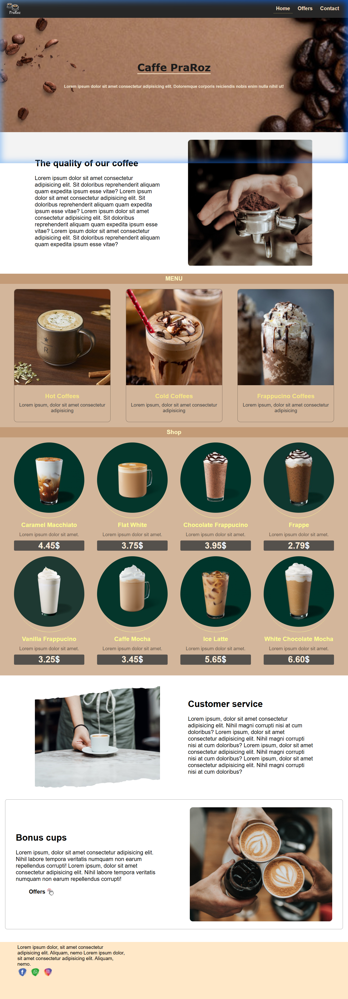
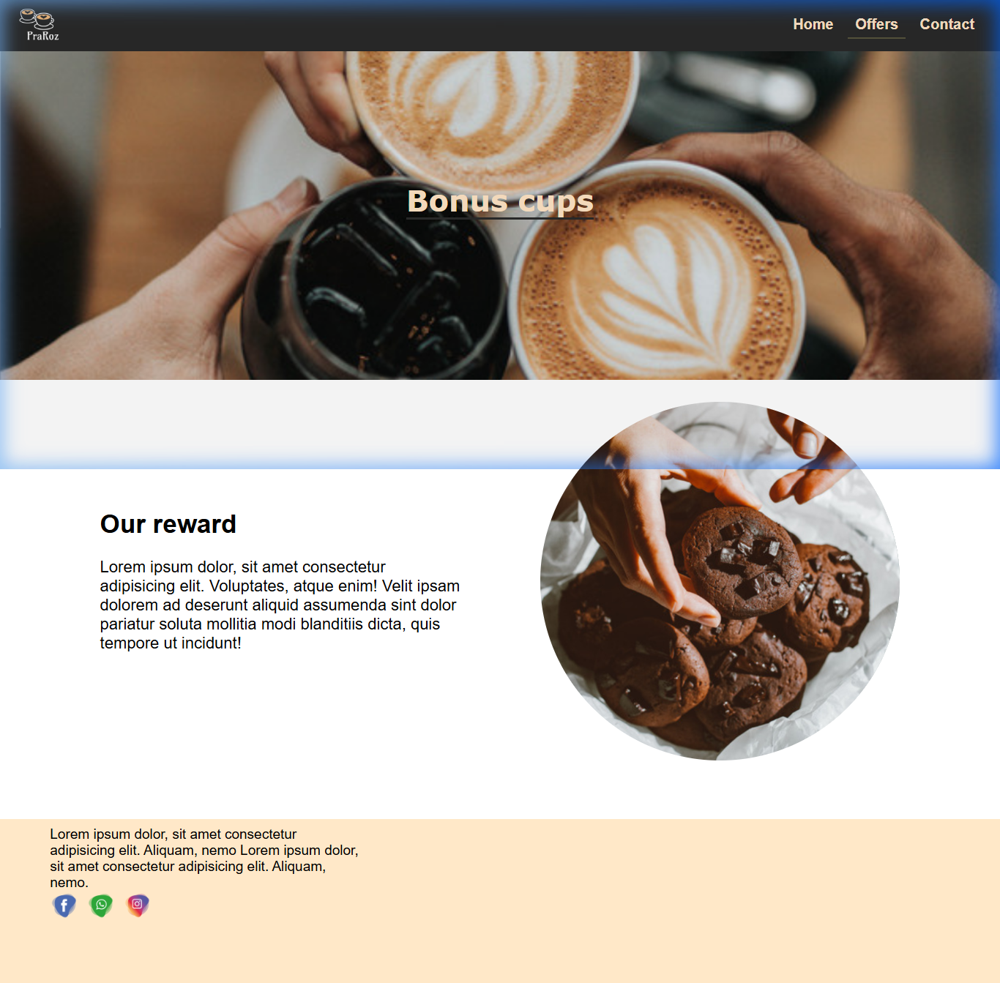
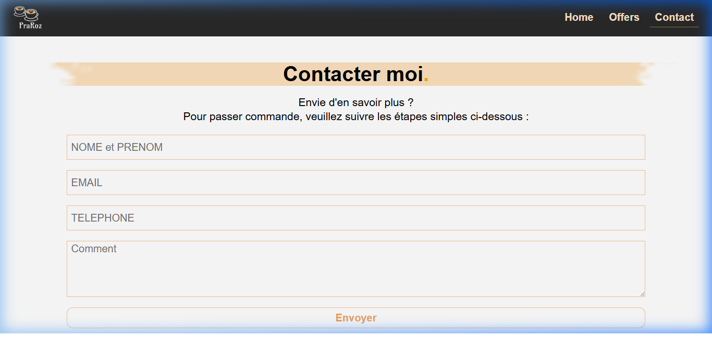

# ☕ Caffe PraRoz - Premium Coffee Experience

Welcome to **Caffe PraRoz**, a modern and elegant coffee shop website designed to showcase a premium coffee experience. This project features a beautiful landing page, exclusive offers, and an interactive contact system.

---

## 🎨 Design Showcase

### 🏠 Homepage
Experience the warm atmosphere and our high-quality coffee selection.


### 🎁 Exclusive Offers
Discover our rewards programs and special bonus cups.


### 📞 Contact Us
Get in touch with us for orders or inquiries.


---

## ✨ Features

- **📱 Fully Responsive Design**: Optimized for desktops, tablets, and smartphones.
- **☕ Interactive Menu**: Browse through our Hot Coffees, Cold Coffees, and Frappuccinos.
- **🛍️ Online Shop Section**: View our premium products with clear pricing.
- **🌟 Customer Service Focus**: Dedicated sections explaining our commitment to quality.
- **📍 Location Integration**: Embedded Google Maps for easy navigation to our shop.
- **📩 Interactive Contact Form**: Simple and effective way for customers to reach out.

---

## 🛠️ Technologies Used

- **HTML5**: Semantic structure for better accessibility and SEO.
- **CSS3**: Custom styling with a focus on premium aesthetics, including:
  - Flexbox & Grid layouts.
  - Custom animations and hover effects.
  - Responsive media queries.
- **Google Maps API**: For location embedding.

---

## 📂 Project Structure

```text
/
├── index.html          # Main landing page
├── offre.html          # Offers and rewards page
├── contacter.html      # Contact and order form page
├── assets/
│   ├── css/
│   │   └── style.css   # Main stylesheet
│   ├── images/         # Project images and icons
│   └── screenshots/    # Project previews
```

---

## 🤝 Contact

Developed with ❤️ for a professional coffee business.
